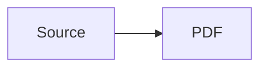

# PDF Build

Build publication-quality PDFs from Markdown sources using Pandoc + XeLaTeX. Supports single-file and multi-file directory-based projects, Mermaid diagram rendering, table of contents, and automated QA.

## Quick Start

```bash
# Build from a project directory (concatenates *.md files alphabetically)
bash scripts/build-pdf.sh path/to/project-dir

# Build a single markdown file
bash scripts/build-pdf.sh path/to/file.md

# Run QA after every build
python scripts/detect-overlaps.py path/to/output.pdf
```

## How It Works

The build script:
1. Finds markdown files (single file or all `*.md` in a directory, sorted alphabetically)
2. Runs Pandoc with XeLaTeX engine
3. Applies a Lua filter that renders `mermaid` code blocks to PNG via mmdc
4. Includes a LaTeX header for typography control (line wrapping, table sizing, figure placement)
5. Generates a table of contents (depth 2)
6. Outputs `<dir-name>.pdf` or `<filename>.pdf`

## Project Structure Convention

Number your markdown files to control page order:

```
my-project/
├── 01-introduction.md
├── 02-background.md
├── 03-analysis.md
├── 04-recommendations.md
└── diagrams/
    └── architecture.mmd
```

Output: `my-project/my-project.pdf`

## Front-Matter Requirements

Every document needs YAML front-matter for proper title page and TOC placement:

```yaml
---
title: "Document Title"
subtitle: "Optional subtitle"
author: "Author Name"
---
```

Place this in the first file (`01-*.md`) for directory mode, or at the top for single-file mode. Without front-matter, the TOC renders above the title — almost never what you want.

Do not duplicate title/subtitle/author as markdown headings in the body.

## Post-Build QA

Always run the overlap detector after building:

```bash
python scripts/detect-overlaps.py path/to/output.pdf
```

It checks for:
- **Overlapping text** — spans whose bounding boxes collide horizontally (usually from wide table columns)
- **Right-margin overflow** — text extending past the 1-inch right margin

If issues are found, fix the source markdown (shorten table columns, break long code lines, split wide content) and rebuild.

Also verify the output exists and has non-zero size:

```bash
ls -lh <output.pdf>
```

A missing or zero-byte file means a silent build failure — check the XeLaTeX output for errors.

## Mermaid Diagrams

Mermaid code blocks are rendered automatically during the build via a Lua filter:

````markdown

````

The filter invokes `npx --yes @mermaid-js/mermaid-cli` — requires Node.js but no global install.

To pre-render diagrams as standalone PNGs (e.g., for use outside the PDF pipeline):

```bash
bash scripts/render-diagrams.sh path/to/diagrams/
```

## Environment Requirements

| Dependency | Purpose | Linux | macOS |
|---|---|---|---|
| Pandoc 3.x | Markdown → LaTeX conversion | `apt install pandoc` | `brew install pandoc` |
| TinyTeX | XeLaTeX engine | see `references/troubleshooting.md` | same; installs under `~/Library/TinyTeX` |
| DejaVu fonts | Unicode coverage | `sudo apt install fonts-dejavu` | must be in `~/Library/Fonts`; see troubleshooting |
| PyMuPDF | QA overlap detection | `pip install PyMuPDF` | same, in a venv |
| Node.js | Mermaid diagram rendering | `nvm install --lts` | same; `node` must be on PATH when the build runs |

The build script finds TinyTeX on its own when it is installed in the default location on either platform (`~/.TinyTeX/bin/*` on Linux, `~/Library/TinyTeX/bin/*` on macOS). If it is elsewhere, put its `bin` directory on PATH before building.

Required LaTeX packages. Pandoc 3.x's default template needs more than the four this pipeline adds; install the whole set once:
```bash
tlmgr install fvextra float etoolbox newunicodechar framed footnotehyper bookmark xcolor \
  geometry ulem unicode-math setspace fancyvrb listings titling lm amsmath parskip \
  microtype caption xurl selnolig upquote lineno tex-gyre booktabs dejavu
```
If `tlmgr` cannot reach its repository, see "tlmgr cannot download" in the troubleshooting reference.

## Troubleshooting

See `references/troubleshooting.md` for common failure scenarios (missing fonts, missing LaTeX packages, blocked package downloads, macOS font registration, Mermaid unavailability, Unicode issues, emoji substitution).
